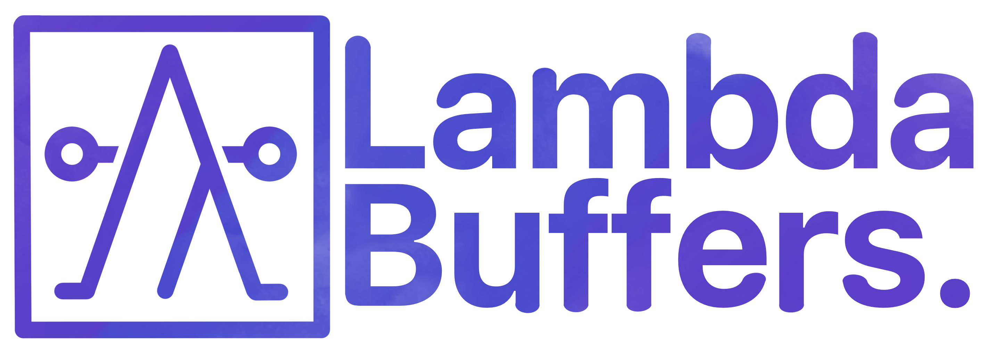

# Lambda Buffers

## Introduction

_LambdaBuffers_ is a schema language (similar to ProtoBuffers, ADL, ASN.1, JSON
Schema, etc.) and associated code generation toolkit. The goal of this project
is to provide developers tools to define algebraic data types in a
language-agnostic format such that shared data types can be declared in one
place while maintaining compatibility across a plethora of supported languages.

Users may refer to the [comparison matrix](./docs/comparison-matrix.md) for an
in-depth comparison of LambdaBuffers' features against the feature-set of other
popular schema-languages.

At a glance, you may wish to choose LambdaBuffers instead of one of its
competitors if your project requires:

 1. _Parameterized Data Types_ (aka. type functions): Unlike ProtoBuffers or
    JSON Schema, LambdaBuffers allows users to define algebraic data types which
    take type variable arguments. If your project's domain is most accurately
    represented by parameterized data types, LambdaBuffers may be a good choice
    for your needs.

 2. _Opaque Types_: Almost every competing schema language provides users a
    fixed set of builtin or primitive types, which are handled in a special
    manner by the code generation and cannot be extended. LambdaBuffers, by
    contrast, allows users to add their own builtin types and extend the
    existing code generation framework to handle those builtins in a manner
    intended by the users. There are no _special_ primitive types in
    LambdaBuffers; a user-defined primitive type is defined in exactly the same
    way (i.e. as an `opaque` type) as a LambdaBuffers "builtin".

 3. _Typeclass Support_: While nearly every schema language supports generating
    type definitions in supported target languages, to our knowledge no schema
    language supports generating commonly used functions that operate on those
    types. Unlike other schema languages, LambdaBuffers supports code generation
    for _typeclass instances_ (or the equivalent in languages that lack support
    for typeclasses) to reduce the amount of boilerplate required to
    productively make use of the generated types. While LambdaBuffers is still a
    work-in-progress, we expect that, upon completion, an extensive test suite
    will provide a high degree of assurance that the instances/methods generated
    by the LambdaBuffers code generator behave identically.

## Documentation

Visit [LambdaBuffers Github Pages](https://mlabs-haskell.github.io/lambda-buffers).

## Acknowledgements

This project was graciously funded by the Cardano Treasury in [Catalyst Fund 9](https://cardano.ideascale.com/c/idea/421376) and [Catalyst Fund 10](https://cardano.ideascale.com/c/idea/105975).

Authors:

- [Drazen Popovic](https://github.com/bladyjoker)
- [Vlad Posmangiu Luchian](https://github.com/cstml)
- [Sean Hunter](https://github.com/gnumonik)

Contributors:

- [George Flerovsky](https://github.com/GeorgeFlerovsky)
- [Andrea Ciceri](https://github.com/aciceri)
- [Julia Chatain](https://juliachatain.com)
- [Andrea Vezzosi](https://github.com/saizan)
- [Magnus Viernickel](https://github.com/MangoIV)
- [Rajdeep Chase Maity](https://github.com/TotallyNotChase)
- [Ramiro Garay](https://github.com/rmgaray)
